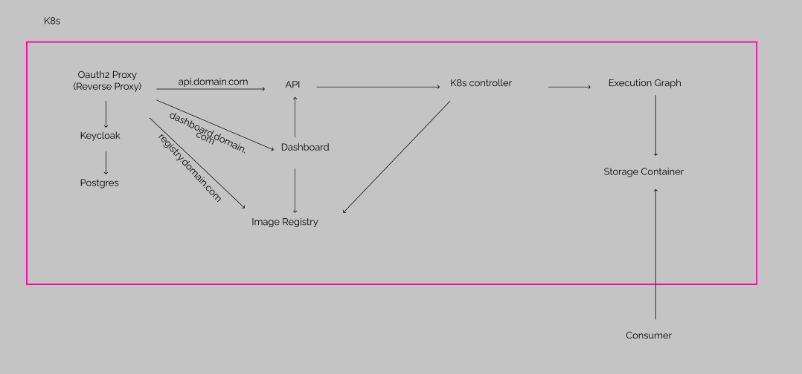

# Kickplate Architecture
Overview

## OAuth2 Proxy
OAuth2 Proxy is a reverse proxy acting as the entrypoint to the platform. Employing defence in depth principles, this prevents any access to the platform not carrying a valid bearer token. By enforcing rules on all traffic this prevents potential security flaws through implementation errors. This is validated through keycloak, storing client data in PostgresDB

## Image Registry
An internal docker registry containing all images of platform components (e.g. dashboard, API, operators...) and any images used by EDAGs.

## Dashboard
A user facing dashboard allowing GUI creation, triggering, and management of EDAGs and associated runs. To see design documents of dashboard visit [Dashboard Design](dashboard-design.md) 

## API
A control plane API allows management of EDAGs and EDAG runs. For more information and specification of API see [API Docs](api.md) 

## Kuberenetes Cluster
### Namespaces & nodes
All platform deployments (API, Dashboard, Image Registry...) and EDAG runs are deployed in separate namespaces. Platform deployments are run along side Kubernetes management in the control node. All EDAG runs are executed in a separate node to control processes, ensuring no runs interfere with platform controllers.

### Creation of an EDAG
When an EDAG is created on the cluster an EDAG custom resource is created containing EDAG definition.

### Execution of a EDAG Run
When an EDAG is executed an EDAGRun custom resource is created. This is then picked up by the **graphmanager**, a custom kubernetes operator, which executes the EDAG. For more information on the graphmanager, see below. To allow consuming of results, a storage account is mounted so results are be exported and later read by other processes. For EDAGs with multiple steps, the same storage account is mounted across the run. The path to this mounted storage account is part of the environment varibles set in the pod

#### Pod Environment Variables
Useful information is provided to the pod via environment variables
|Environment Varible Name|Description|
|------|------|
| STORAGE_ACC_PATH | path to storage acount for permenant data storage |
| STEP_INDEX | Index of the replica within the step |
### Graphmanager Operator
Whenever a change is detected to an EDAG Run resource, e.g. creation of a new run, the reconcilation loop is triggered. This evaluates the state of the run by fetching statuses of the steps and, if appropriate, starting new steps or pronounce the run failed/finished. For more information on the kubernetes operator visit [Kubernetes Operator](https://kubernetes.io/docs/concepts/extend-kubernetes/operator/).

There are two patterns for an EDAG run step, named Hot and Cold.

#### Cold Step
A cold step uses the **IndexedJob** deployment which creates pods according to the replicas defined within the step definition. These pods are created at step start. This is best for slow, high-computation, batch jobs. This is due to the time delay in starting the pods, which for small jobs can be a significant portion of the execution time. 

#### Hot Step 
A hot step uses a producer-consumer pattern. Jobs are placed on the RabbitMQ messaging service (producer). Custom workers (consumers), written by the users, then read jobs off the messaging service and execute the jobs. This is useful for smaller jobs as the producer & consumer can be kept alive between jobs, avoiding the startup time issue faced in cold step.    

## Future Improvements
### Telemetry, Metrics & Alerting
Telemetry and metrics are not currently implemented. This would help operator oversight and respones speed to errors.

### Architecture Resilience 
Proposed measures to architecture to improve platform resiliency
 - Utilising pod replication on deployments
 - Geozone redundant storage (16 9's SLA) with daily backup policy 
 - Blue-Green kubernetes deployments to perform cluster upgrades and provide a backup for minimal downtime disaster recovery
 - Utilising kubernetes rollout to do rolling updates with zero downtime
 - Monitoring and alerting for rapid response
 - CDN for redundancy and speed improvements
- Horizontal scaling of cluster to improve performance under high loads

### Redis Cache
For some high speed executions a Redis cache could help data transfer times

### Execution Security
Given unknown code is running on the platform, some further steps could be taken to improve security of the platform if this was brought to production. Some measures have already been put in place such as isolating user processes and RBAC for permission to run EDAGs. Some future improvements could be blacklisting kubernetes control plane IP addresses from run pods, setting more granular security contexts for the pods, controlling node access.

### T-Shirt Sizing of Resource Limits
Allow selecting of resource limits via T-Shirt sizes (S, M, L) depending on resource requirements of jobs

### Scheduled EDAGs
Allow EDAGs to be performed on a schedule.